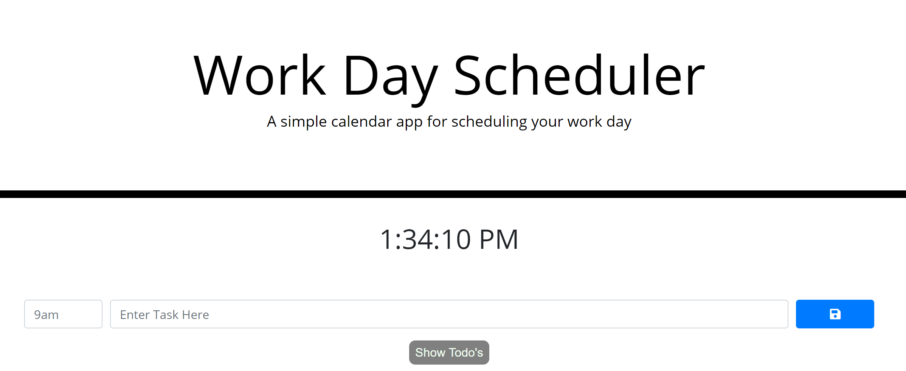

# day-planner-refactor
Refactoring a Day Planner using Reactjs
  
  
  
  
  ## Table of Contents
  1. [Demo](#Demo)
  2. [License](#License)
  3. [Questions](#Questions)
  
  ## Demo
  
  Navigate to the live site  
  
  [Check it out here!](https://angeleefshaw.github.io/day-planner-refactor/ "Workday planner")
  
  
  
  Enter tasks into the input field. Hover over the blue button and click to save the task. Each task will be listed below the input feild. Click "Show Todo's" to reveal all tasks.

  ## License
  This project operates under the MIT license
  
  
  
  
  ## Questions
  
  GITHUB: https://github.com/angeleefshaw
  EMAIL: angeleefshaw@gmail.com
  LINKEDIN: https://www.linkedin.com/in/angelee-shaw-2a65861bb/
  
